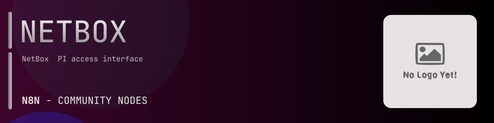

# @n8n-dev/n8n-nodes-netbox



[](https://www.npmjs.com/package/@n8n-dev/n8n-nodes-netbox)
[](https://opensource.org/licenses/MIT)

---

**Stop writing netbox API integrations by hand.**

Every time you connect n8n to netbox, you waste hours mapping endpoints, defining parameters, and debugging schemas. You copy-paste from docs, fix edge cases, and pray nothing breaks.

**What if connecting n8n to netbox took 5 minutes, not half a day?**

This node gives you **9+ resources** out of the box: **Circuits**, **Dcim**, **Extras**, **Ipam**, **Status**, and 4 more: with full CRUD operations, typed parameters, and zero manual configuration.

---

## What You Get

- **Zero boilerplate**: Resources, operations, and fields are pre-configured and ready to use
- **Full CRUD**: Create, read, update, and delete support where the API allows it
- **Typed parameters**: No more guessing field types
- **Built-in auth**: API key authentication, ready to go
- **Declarative**: Native n8n performance, no custom execute() overhead

---

## Install

```bash
npm install @n8n-dev/n8n-nodes-netbox
```

**Or in n8n:**
1. **Settings → Community Nodes → Install**
2. Search: `@n8n-dev/n8n-nodes-netbox`
3. Click **Install**

---

## Quick Start

1. Install the node (above)
2. Add credentials: **netbox API** → paste your API key
3. Drag the **netbox** node into your workflow
4. Pick a resource → pick an operation → done.

That's it. No configuration files. No code. It just works.

---

## Resources

| Resource | Operations |
|----------|------------|
| Circuits | Delete circuits circuit terminations bulk delete, Get circuits circuit terminations list, Patch circuits circuit terminations bulk partial update, Post circuits circuit terminations create, Put circuits circuit terminations bulk update, Delete circuits circuit terminations delete, Get circuits circuit terminations read, Patch circuits circuit terminations partial update, Put circuits circuit terminations update, Get circuits circuit terminations paths, Delete circuits circuit types bulk delete, Get circuits circuit types list, Patch circuits circuit types bulk partial update, Post circuits circuit types create, Put circuits circuit types bulk update, Delete circuits circuit types delete, Get circuits circuit types read, Patch circuits circuit types partial update, Put circuits circuit types update, Delete circuits circuits bulk delete, Get circuits circuits list, Patch circuits circuits bulk partial update, Post circuits circuits create, Put circuits circuits bulk update, Delete circuits circuits delete, Get circuits circuits read, Patch circuits circuits partial update, Put circuits circuits update, Delete circuits provider networks bulk delete, Get circuits provider networks list, Patch circuits provider networks bulk partial update, Post circuits provider networks create, Put circuits provider networks bulk update, Delete circuits provider networks delete, Get circuits provider networks read, Patch circuits provider networks partial update, Put circuits provider networks update, Delete circuits providers bulk delete, Get circuits providers list, Patch circuits providers bulk partial update, Post circuits providers create, Put circuits providers bulk update, Delete circuits providers delete, Get circuits providers read, Patch circuits providers partial update, Put circuits providers update |
| Dcim | Delete dcim cable terminations bulk delete, Get dcim cable terminations list, Patch dcim cable terminations bulk partial update, Post dcim cable terminations create, Put dcim cable terminations bulk update, Delete dcim cable terminations delete, Get dcim cable terminations read, Patch dcim cable terminations partial update, Put dcim cable terminations update, Delete dcim cables bulk delete, Get dcim cables list, Patch dcim cables bulk partial update, Post dcim cables create, Put dcim cables bulk update, Delete dcim cables delete, Get dcim cables read, Patch dcim cables partial update, Put dcim cables update, Get dcim connected device list, Delete dcim console port templates bulk delete, Get dcim console port templates list, Patch dcim console port templates bulk partial update, Post dcim console port templates create, Put dcim console port templates bulk update, Delete dcim console port templates delete, Get dcim console port templates read, Patch dcim console port templates partial update, Put dcim console port templates update, Delete dcim console ports bulk delete, Get dcim console ports list, Patch dcim console ports bulk partial update, Post dcim console ports create, Put dcim console ports bulk update, Delete dcim console ports delete, Get dcim console ports read, Patch dcim console ports partial update, Put dcim console ports update, Get dcim console ports trace, Delete dcim console server port templates bulk delete, Get dcim console server port templates list, Patch dcim console server port templates bulk partial update, Post dcim console server port templates create, Put dcim console server port templates bulk update, Delete dcim console server port templates delete, Get dcim console server port templates read, Patch dcim console server port templates partial update, Put dcim console server port templates update, Delete dcim console server ports bulk delete, Get dcim console server ports list, Patch dcim console server ports bulk partial update, Post dcim console server ports create, Put dcim console server ports bulk update, Delete dcim console server ports delete, Get dcim console server ports read, Patch dcim console server ports partial update, Put dcim console server ports update, Get dcim console server ports trace, Delete dcim device bay templates bulk delete, Get dcim device bay templates list, Patch dcim device bay templates bulk partial update, Post dcim device bay templates create, Put dcim device bay templates bulk update, Delete dcim device bay templates delete, Get dcim device bay templates read, Patch dcim device bay templates partial update, Put dcim device bay templates update, Delete dcim device bays bulk delete, Get dcim device bays list, Patch dcim device bays bulk partial update, Post dcim device bays create, Put dcim device bays bulk update, Delete dcim device bays delete, Get dcim device bays read, Patch dcim device bays partial update, Put dcim device bays update, Delete dcim device roles bulk delete, Get dcim device roles list, Patch dcim device roles bulk partial update, Post dcim device roles create, Put dcim device roles bulk update, Delete dcim device roles delete, Get dcim device roles read, Patch dcim device roles partial update, Put dcim device roles update, Delete dcim device types bulk delete, Get dcim device types list, Patch dcim device types bulk partial update, Post dcim device types create, Put dcim device types bulk update, Delete dcim device types delete, Get dcim device types read, Patch dcim device types partial update, Put dcim device types update, Delete dcim devices bulk delete, Get dcim devices list, Patch dcim devices bulk partial update, Post dcim devices create, Put dcim devices bulk update, Delete dcim devices delete, Get dcim devices read, Patch dcim devices partial update, Put dcim devices update, Get dcim devices napalm, Delete dcim front port templates bulk delete, Get dcim front port templates list, Patch dcim front port templates bulk partial update, Post dcim front port templates create, Put dcim front port templates bulk update, Delete dcim front port templates delete, Get dcim front port templates read, Patch dcim front port templates partial update, Put dcim front port templates update, Delete dcim front ports bulk delete, Get dcim front ports list, Patch dcim front ports bulk partial update, Post dcim front ports create, Put dcim front ports bulk update, Delete dcim front ports delete, Get dcim front ports read, Patch dcim front ports partial update, Put dcim front ports update, Get dcim front ports paths, Delete dcim interface templates bulk delete, Get dcim interface templates list, Patch dcim interface templates bulk partial update, Post dcim interface templates create, Put dcim interface templates bulk update, Delete dcim interface templates delete, Get dcim interface templates read, Patch dcim interface templates partial update, Put dcim interface templates update, Delete dcim interfaces bulk delete, Get dcim interfaces list, Patch dcim interfaces bulk partial update, Post dcim interfaces create, Put dcim interfaces bulk update, Delete dcim interfaces delete, Get dcim interfaces read, Patch dcim interfaces partial update, Put dcim interfaces update, Get dcim interfaces trace, Delete dcim inventory item roles bulk delete, Get dcim inventory item roles list, Patch dcim inventory item roles bulk partial update, Post dcim inventory item roles create, Put dcim inventory item roles bulk update, Delete dcim inventory item roles delete, Get dcim inventory item roles read, Patch dcim inventory item roles partial update, Put dcim inventory item roles update, Delete dcim inventory item templates bulk delete, Get dcim inventory item templates list, Patch dcim inventory item templates bulk partial update, Post dcim inventory item templates create, Put dcim inventory item templates bulk update, Delete dcim inventory item templates delete, Get dcim inventory item templates read, Patch dcim inventory item templates partial update, Put dcim inventory item templates update, Delete dcim inventory items bulk delete, Get dcim inventory items list, Patch dcim inventory items bulk partial update, Post dcim inventory items create, Put dcim inventory items bulk update, Delete dcim inventory items delete, Get dcim inventory items read, Patch dcim inventory items partial update, Put dcim inventory items update, Delete dcim locations bulk delete, Get dcim locations list, Patch dcim locations bulk partial update, Post dcim locations create, Put dcim locations bulk update, Delete dcim locations delete, Get dcim locations read, Patch dcim locations partial update, Put dcim locations update, Delete dcim manufacturers bulk delete, Get dcim manufacturers list, Patch dcim manufacturers bulk partial update, Post dcim manufacturers create, Put dcim manufacturers bulk update, Delete dcim manufacturers delete, Get dcim manufacturers read, Patch dcim manufacturers partial update, Put dcim manufacturers update, Delete dcim module bay templates bulk delete, Get dcim module bay templates list, Patch dcim module bay templates bulk partial update, Post dcim module bay templates create, Put dcim module bay templates bulk update, Delete dcim module bay templates delete, Get dcim module bay templates read, Patch dcim module bay templates partial update, Put dcim module bay templates update, Delete dcim module bays bulk delete, Get dcim module bays list, Patch dcim module bays bulk partial update, Post dcim module bays create, Put dcim module bays bulk update, Delete dcim module bays delete, Get dcim module bays read, Patch dcim module bays partial update, Put dcim module bays update, Delete dcim module types bulk delete, Get dcim module types list, Patch dcim module types bulk partial update, Post dcim module types create, Put dcim module types bulk update, Delete dcim module types delete, Get dcim module types read, Patch dcim module types partial update, Put dcim module types update, Delete dcim modules bulk delete, Get dcim modules list, Patch dcim modules bulk partial update, Post dcim modules create, Put dcim modules bulk update, Delete dcim modules delete, Get dcim modules read, Patch dcim modules partial update, Put dcim modules update, Delete dcim platforms bulk delete, Get dcim platforms list, Patch dcim platforms bulk partial update, Post dcim platforms create, Put dcim platforms bulk update, Delete dcim platforms delete, Get dcim platforms read, Patch dcim platforms partial update, Put dcim platforms update, Delete dcim power feeds bulk delete, Get dcim power feeds list, Patch dcim power feeds bulk partial update, Post dcim power feeds create, Put dcim power feeds bulk update, Delete dcim power feeds delete, Get dcim power feeds read, Patch dcim power feeds partial update, Put dcim power feeds update, Get dcim power feeds trace, Delete dcim power outlet templates bulk delete, Get dcim power outlet templates list, Patch dcim power outlet templates bulk partial update, Post dcim power outlet templates create, Put dcim power outlet templates bulk update, Delete dcim power outlet templates delete, Get dcim power outlet templates read, Patch dcim power outlet templates partial update, Put dcim power outlet templates update, Delete dcim power outlets bulk delete, Get dcim power outlets list, Patch dcim power outlets bulk partial update, Post dcim power outlets create, Put dcim power outlets bulk update, Delete dcim power outlets delete, Get dcim power outlets read, Patch dcim power outlets partial update, Put dcim power outlets update, Get dcim power outlets trace, Delete dcim power panels bulk delete, Get dcim power panels list, Patch dcim power panels bulk partial update, Post dcim power panels create, Put dcim power panels bulk update, Delete dcim power panels delete, Get dcim power panels read, Patch dcim power panels partial update, Put dcim power panels update, Delete dcim power port templates bulk delete, Get dcim power port templates list, Patch dcim power port templates bulk partial update, Post dcim power port templates create, Put dcim power port templates bulk update, Delete dcim power port templates delete, Get dcim power port templates read, Patch dcim power port templates partial update, Put dcim power port templates update, Delete dcim power ports bulk delete, Get dcim power ports list, Patch dcim power ports bulk partial update, Post dcim power ports create, Put dcim power ports bulk update, Delete dcim power ports delete, Get dcim power ports read, Patch dcim power ports partial update, Put dcim power ports update, Get dcim power ports trace, Delete dcim rack reservations bulk delete, Get dcim rack reservations list, Patch dcim rack reservations bulk partial update, Post dcim rack reservations create, Put dcim rack reservations bulk update, Delete dcim rack reservations delete, Get dcim rack reservations read, Patch dcim rack reservations partial update, Put dcim rack reservations update, Delete dcim rack roles bulk delete, Get dcim rack roles list, Patch dcim rack roles bulk partial update, Post dcim rack roles create, Put dcim rack roles bulk update, Delete dcim rack roles delete, Get dcim rack roles read, Patch dcim rack roles partial update, Put dcim rack roles update, Delete dcim racks bulk delete, Get dcim racks list, Patch dcim racks bulk partial update, Post dcim racks create, Put dcim racks bulk update, Delete dcim racks delete, Get dcim racks read, Patch dcim racks partial update, Put dcim racks update, Get dcim racks elevation, Delete dcim rear port templates bulk delete, Get dcim rear port templates list, Patch dcim rear port templates bulk partial update, Post dcim rear port templates create, Put dcim rear port templates bulk update, Delete dcim rear port templates delete, Get dcim rear port templates read, Patch dcim rear port templates partial update, Put dcim rear port templates update, Delete dcim rear ports bulk delete, Get dcim rear ports list, Patch dcim rear ports bulk partial update, Post dcim rear ports create, Put dcim rear ports bulk update, Delete dcim rear ports delete, Get dcim rear ports read, Patch dcim rear ports partial update, Put dcim rear ports update, Get dcim rear ports paths, Delete dcim regions bulk delete, Get dcim regions list, Patch dcim regions bulk partial update, Post dcim regions create, Put dcim regions bulk update, Delete dcim regions delete, Get dcim regions read, Patch dcim regions partial update, Put dcim regions update, Delete dcim site groups bulk delete, Get dcim site groups list, Patch dcim site groups bulk partial update, Post dcim site groups create, Put dcim site groups bulk update, Delete dcim site groups delete, Get dcim site groups read, Patch dcim site groups partial update, Put dcim site groups update, Delete dcim sites bulk delete, Get dcim sites list, Patch dcim sites bulk partial update, Post dcim sites create, Put dcim sites bulk update, Delete dcim sites delete, Get dcim sites read, Patch dcim sites partial update, Put dcim sites update, Delete dcim virtual chassis bulk delete, Get dcim virtual chassis list, Patch dcim virtual chassis bulk partial update, Post dcim virtual chassis create, Put dcim virtual chassis bulk update, Delete dcim virtual chassis delete, Get dcim virtual chassis read, Patch dcim virtual chassis partial update, Put dcim virtual chassis update, Delete dcim virtual device contexts bulk delete, Get dcim virtual device contexts list, Patch dcim virtual device contexts bulk partial update, Post dcim virtual device contexts create, Put dcim virtual device contexts bulk update, Delete dcim virtual device contexts delete, Get dcim virtual device contexts read, Patch dcim virtual device contexts partial update, Put dcim virtual device contexts update |
| Extras | Delete extras config contexts bulk delete, Get extras config contexts list, Patch extras config contexts bulk partial update, Post extras config contexts create, Put extras config contexts bulk update, Delete extras config contexts delete, Get extras config contexts read, Patch extras config contexts partial update, Put extras config contexts update, Get extras content types list, Get extras content types read, Delete extras custom fields bulk delete, Get extras custom fields list, Patch extras custom fields bulk partial update, Post extras custom fields create, Put extras custom fields bulk update, Delete extras custom fields delete, Get extras custom fields read, Patch extras custom fields partial update, Put extras custom fields update, Delete extras custom links bulk delete, Get extras custom links list, Patch extras custom links bulk partial update, Post extras custom links create, Put extras custom links bulk update, Delete extras custom links delete, Get extras custom links read, Patch extras custom links partial update, Put extras custom links update, Delete extras export templates bulk delete, Get extras export templates list, Patch extras export templates bulk partial update, Post extras export templates create, Put extras export templates bulk update, Delete extras export templates delete, Get extras export templates read, Patch extras export templates partial update, Put extras export templates update, Delete extras image attachments bulk delete, Get extras image attachments list, Patch extras image attachments bulk partial update, Post extras image attachments create, Put extras image attachments bulk update, Delete extras image attachments delete, Get extras image attachments read, Patch extras image attachments partial update, Put extras image attachments update, Get extras job results list, Get extras job results read, Delete extras journal entries bulk delete, Get extras journal entries list, Patch extras journal entries bulk partial update, Post extras journal entries create, Put extras journal entries bulk update, Delete extras journal entries delete, Get extras journal entries read, Patch extras journal entries partial update, Put extras journal entries update, Get extras object changes list, Get extras object changes read, Get extras reports list, Get extras reports read, Post extras reports run, Delete extras saved filters bulk delete, Get extras saved filters list, Patch extras saved filters bulk partial update, Post extras saved filters create, Put extras saved filters bulk update, Delete extras saved filters delete, Get extras saved filters read, Patch extras saved filters partial update, Put extras saved filters update, Get extras scripts list, Get extras scripts read, Delete extras tags bulk delete, Get extras tags list, Patch extras tags bulk partial update, Post extras tags create, Put extras tags bulk update, Delete extras tags delete, Get extras tags read, Patch extras tags partial update, Put extras tags update, Delete extras webhooks bulk delete, Get extras webhooks list, Patch extras webhooks bulk partial update, Post extras webhooks create, Put extras webhooks bulk update, Delete extras webhooks delete, Get extras webhooks read, Patch extras webhooks partial update, Put extras webhooks update |
| Ipam | Delete ipam aggregates bulk delete, Get ipam aggregates list, Patch ipam aggregates bulk partial update, Post ipam aggregates create, Put ipam aggregates bulk update, Delete ipam aggregates delete, Get ipam aggregates read, Patch ipam aggregates partial update, Put ipam aggregates update, Delete ipam asns bulk delete, Get ipam asns list, Patch ipam asns bulk partial update, Post ipam asns create, Put ipam asns bulk update, Delete ipam asns delete, Get ipam asns read, Patch ipam asns partial update, Put ipam asns update, Delete ipam fhrp group assignments bulk delete, Get ipam fhrp group assignments list, Patch ipam fhrp group assignments bulk partial update, Post ipam fhrp group assignments create, Put ipam fhrp group assignments bulk update, Delete ipam fhrp group assignments delete, Get ipam fhrp group assignments read, Patch ipam fhrp group assignments partial update, Put ipam fhrp group assignments update, Delete ipam fhrp groups bulk delete, Get ipam fhrp groups list, Patch ipam fhrp groups bulk partial update, Post ipam fhrp groups create, Put ipam fhrp groups bulk update, Delete ipam fhrp groups delete, Get ipam fhrp groups read, Patch ipam fhrp groups partial update, Put ipam fhrp groups update, Delete ipam ip addresses bulk delete, Get ipam ip addresses list, Patch ipam ip addresses bulk partial update, Post ipam ip addresses create, Put ipam ip addresses bulk update, Delete ipam ip addresses delete, Get ipam ip addresses read, Patch ipam ip addresses partial update, Put ipam ip addresses update, Delete ipam ip ranges bulk delete, Get ipam ip ranges list, Patch ipam ip ranges bulk partial update, Post ipam ip ranges create, Put ipam ip ranges bulk update, Delete ipam ip ranges delete, Get ipam ip ranges read, Patch ipam ip ranges partial update, Put ipam ip ranges update, Get ipam ip ranges available ips list, Post ipam ip ranges available ips create, Delete ipam l 2 vpn terminations bulk delete, Get ipam l 2 vpn terminations list, Patch ipam l 2 vpn terminations bulk partial update, Post ipam l 2 vpn terminations create, Put ipam l 2 vpn terminations bulk update, Delete ipam l 2 vpn terminations delete, Get ipam l 2 vpn terminations read, Patch ipam l 2 vpn terminations partial update, Put ipam l 2 vpn terminations update, Delete ipam l 2 vpns bulk delete, Get ipam l 2 vpns list, Patch ipam l 2 vpns bulk partial update, Post ipam l 2 vpns create, Put ipam l 2 vpns bulk update, Delete ipam l 2 vpns delete, Get ipam l 2 vpns read, Patch ipam l 2 vpns partial update, Put ipam l 2 vpns update, Delete ipam prefixes bulk delete, Get ipam prefixes list, Patch ipam prefixes bulk partial update, Post ipam prefixes create, Put ipam prefixes bulk update, Delete ipam prefixes delete, Get ipam prefixes read, Patch ipam prefixes partial update, Put ipam prefixes update, Get ipam prefixes available ips list, Post ipam prefixes available ips create, Get ipam prefixes available prefixes list, Post ipam prefixes available prefixes create, Delete ipam rirs bulk delete, Get ipam rirs list, Patch ipam rirs bulk partial update, Post ipam rirs create, Put ipam rirs bulk update, Delete ipam rirs delete, Get ipam rirs read, Patch ipam rirs partial update, Put ipam rirs update, Delete ipam roles bulk delete, Get ipam roles list, Patch ipam roles bulk partial update, Post ipam roles create, Put ipam roles bulk update, Delete ipam roles delete, Get ipam roles read, Patch ipam roles partial update, Put ipam roles update, Delete ipam route targets bulk delete, Get ipam route targets list, Patch ipam route targets bulk partial update, Post ipam route targets create, Put ipam route targets bulk update, Delete ipam route targets delete, Get ipam route targets read, Patch ipam route targets partial update, Put ipam route targets update, Delete ipam service templates bulk delete, Get ipam service templates list, Patch ipam service templates bulk partial update, Post ipam service templates create, Put ipam service templates bulk update, Delete ipam service templates delete, Get ipam service templates read, Patch ipam service templates partial update, Put ipam service templates update, Delete ipam services bulk delete, Get ipam services list, Patch ipam services bulk partial update, Post ipam services create, Put ipam services bulk update, Delete ipam services delete, Get ipam services read, Patch ipam services partial update, Put ipam services update, Delete ipam vlan groups bulk delete, Get ipam vlan groups list, Patch ipam vlan groups bulk partial update, Post ipam vlan groups create, Put ipam vlan groups bulk update, Delete ipam vlan groups delete, Get ipam vlan groups read, Patch ipam vlan groups partial update, Put ipam vlan groups update, Get ipam vlan groups available vlans list, Post ipam vlan groups available vlans create, Delete ipam vlans bulk delete, Get ipam vlans list, Patch ipam vlans bulk partial update, Post ipam vlans create, Put ipam vlans bulk update, Delete ipam vlans delete, Get ipam vlans read, Patch ipam vlans partial update, Put ipam vlans update, Delete ipam vrfs bulk delete, Get ipam vrfs list, Patch ipam vrfs bulk partial update, Post ipam vrfs create, Put ipam vrfs bulk update, Delete ipam vrfs delete, Get ipam vrfs read, Patch ipam vrfs partial update, Put ipam vrfs update |
| Status | Get status list |
| Tenancy | Delete tenancy contact assignments bulk delete, Get tenancy contact assignments list, Patch tenancy contact assignments bulk partial update, Post tenancy contact assignments create, Put tenancy contact assignments bulk update, Delete tenancy contact assignments delete, Get tenancy contact assignments read, Patch tenancy contact assignments partial update, Put tenancy contact assignments update, Delete tenancy contact groups bulk delete, Get tenancy contact groups list, Patch tenancy contact groups bulk partial update, Post tenancy contact groups create, Put tenancy contact groups bulk update, Delete tenancy contact groups delete, Get tenancy contact groups read, Patch tenancy contact groups partial update, Put tenancy contact groups update, Delete tenancy contact roles bulk delete, Get tenancy contact roles list, Patch tenancy contact roles bulk partial update, Post tenancy contact roles create, Put tenancy contact roles bulk update, Delete tenancy contact roles delete, Get tenancy contact roles read, Patch tenancy contact roles partial update, Put tenancy contact roles update, Delete tenancy contacts bulk delete, Get tenancy contacts list, Patch tenancy contacts bulk partial update, Post tenancy contacts create, Put tenancy contacts bulk update, Delete tenancy contacts delete, Get tenancy contacts read, Patch tenancy contacts partial update, Put tenancy contacts update, Delete tenancy tenant groups bulk delete, Get tenancy tenant groups list, Patch tenancy tenant groups bulk partial update, Post tenancy tenant groups create, Put tenancy tenant groups bulk update, Delete tenancy tenant groups delete, Get tenancy tenant groups read, Patch tenancy tenant groups partial update, Put tenancy tenant groups update, Delete tenancy tenants bulk delete, Get tenancy tenants list, Patch tenancy tenants bulk partial update, Post tenancy tenants create, Put tenancy tenants bulk update, Delete tenancy tenants delete, Get tenancy tenants read, Patch tenancy tenants partial update, Put tenancy tenants update |
| Users | Get users config list, Delete users groups bulk delete, Get users groups list, Patch users groups bulk partial update, Post users groups create, Put users groups bulk update, Delete users groups delete, Get users groups read, Patch users groups partial update, Put users groups update, Delete users permissions bulk delete, Get users permissions list, Patch users permissions bulk partial update, Post users permissions create, Put users permissions bulk update, Delete users permissions delete, Get users permissions read, Patch users permissions partial update, Put users permissions update, Delete users tokens bulk delete, Get users tokens list, Patch users tokens bulk partial update, Post users tokens create, Put users tokens bulk update, Post users tokens provision create, Delete users tokens delete, Get users tokens read, Patch users tokens partial update, Put users tokens update, Delete users users bulk delete, Get users users list, Patch users users bulk partial update, Post users users create, Put users users bulk update, Delete users users delete, Get users users read, Patch users users partial update, Put users users update |
| Virtualization | Delete virtualization cluster groups bulk delete, Get virtualization cluster groups list, Patch virtualization cluster groups bulk partial update, Post virtualization cluster groups create, Put virtualization cluster groups bulk update, Delete virtualization cluster groups delete, Get virtualization cluster groups read, Patch virtualization cluster groups partial update, Put virtualization cluster groups update, Delete virtualization cluster types bulk delete, Get virtualization cluster types list, Patch virtualization cluster types bulk partial update, Post virtualization cluster types create, Put virtualization cluster types bulk update, Delete virtualization cluster types delete, Get virtualization cluster types read, Patch virtualization cluster types partial update, Put virtualization cluster types update, Delete virtualization clusters bulk delete, Get virtualization clusters list, Patch virtualization clusters bulk partial update, Post virtualization clusters create, Put virtualization clusters bulk update, Delete virtualization clusters delete, Get virtualization clusters read, Patch virtualization clusters partial update, Put virtualization clusters update, Delete virtualization interfaces bulk delete, Get virtualization interfaces list, Patch virtualization interfaces bulk partial update, Post virtualization interfaces create, Put virtualization interfaces bulk update, Delete virtualization interfaces delete, Get virtualization interfaces read, Patch virtualization interfaces partial update, Put virtualization interfaces update, Delete virtualization virtual machines bulk delete, Get virtualization virtual machines list, Patch virtualization virtual machines bulk partial update, Post virtualization virtual machines create, Put virtualization virtual machines bulk update, Delete virtualization virtual machines delete, Get virtualization virtual machines read, Patch virtualization virtual machines partial update, Put virtualization virtual machines update |
| Wireless | Delete wireless wireless lan groups bulk delete, Get wireless wireless lan groups list, Patch wireless wireless lan groups bulk partial update, Post wireless wireless lan groups create, Put wireless wireless lan groups bulk update, Delete wireless wireless lan groups delete, Get wireless wireless lan groups read, Patch wireless wireless lan groups partial update, Put wireless wireless lan groups update, Delete wireless wireless lans bulk delete, Get wireless wireless lans list, Patch wireless wireless lans bulk partial update, Post wireless wireless lans create, Put wireless wireless lans bulk update, Delete wireless wireless lans delete, Get wireless wireless lans read, Patch wireless wireless lans partial update, Put wireless wireless lans update, Delete wireless wireless links bulk delete, Get wireless wireless links list, Patch wireless wireless links bulk partial update, Post wireless wireless links create, Put wireless wireless links bulk update, Delete wireless wireless links delete, Get wireless wireless links read, Patch wireless wireless links partial update, Put wireless wireless links update |

---

## Why This Node?

**Without this node:**
- Hours of manual API integration
- Copy-pasting from netbox docs
- Debugging auth, pagination, error handling
- Maintaining your own client code

**With this node:**
- Install → configure → use. 5 minutes.
- Auto-generated from the official netbox OpenAPI spec
- Always up to date when the API changes
- Native n8n performance

---

## Auto-Generated
This node was auto-generated from the official **netbox** OpenAPI specification using
[@n8n-dev/n8n-openapi-node-ultimate](https://github.com/kelvinzer0/n8n-openapi-node-ultimate),
then validated against the live API so you get accurate types and real parameters, not guesswork.

When the netbox API updates, this node updates too.

---

## Support This Project

If this node saved you hours of work, consider supporting continued development, new APIs, better error handling, and faster updates.

[](https://n8n-code.github.io/membership/#/eyJ0aXRsZSI6IktlZXAgSXQgTW92aW5nIiwiZGVzYyI6Ik9uZSBkZXZlbG9wZXIgYnVpbHQgYSB0b29sIHRoYXQgYXV0by1nZW5lcmF0ZXNcbm44biBub2RlcyBmcm9tIGFueSBPcGVuQVBJIHNwZWMuXG5cbllvdXIgZG9uYXRpb24gZnVuZHMgbmV3IGZlYXR1cmVzLCBtb3JlIEFQSSBzdXBwb3J0LFxuYW5kIGJldHRlciB0b29saW5nIGZvciBldmVyeSBkZXZlbG9wZXIgYWZ0ZXIgeW91LiIsInRhcmdldCI6NTAwMCwiYWRkcmVzc2VzIjp7ImV0aGVyZXVtIjoiMHhmMDU1NWQ0MGRiRkI0ZTNCZjA3MDQ0MjgyQjc4RjJmRTFmNTFFZjcyIiwic29sYW5hIjoiNlpEVk5BYmpZZExEcXo4cGt3VUNHYllaNVV3QlFranB0QzU1Wk5vTFcybVUifSwiZGlzY29yZCI6Imh0dHBzOi8vZGlzY29yZC5nZy9wdERaOGU0aDkzIn0)

---

## License

MIT © [kelvinzer0](https://github.com/n8n-code)
